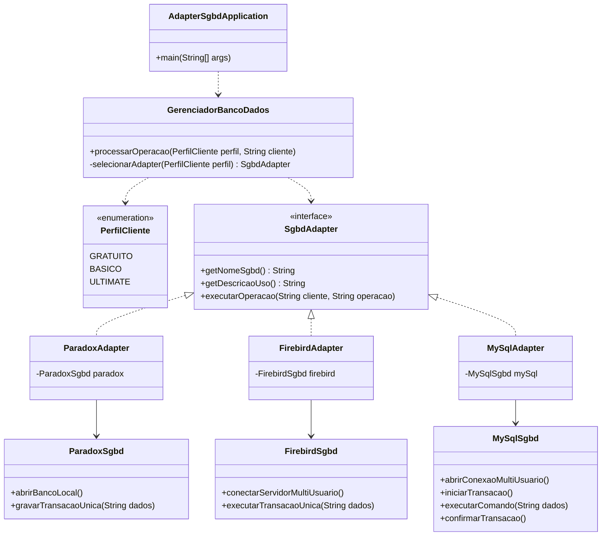

# UML - Adapter SGBD

```mermaid
classDiagram
    class AdapterSgbdApplication {
        +main(String[] args)
    }

    class PerfilCliente {
        <<enumeration>>
        GRATUITO
        BASICO
        ULTIMATE
    }

    class GerenciadorBancoDados {
        +processarOperacao(PerfilCliente perfil, String cliente)
        -selecionarAdapter(PerfilCliente perfil) SgbdAdapter
    }

    class SgbdAdapter {
        <<interface>>
        +getNomeSgbd() String
        +getDescricaoUso() String
        +executarOperacao(String cliente, String operacao)
    }

    class ParadoxAdapter {
        -ParadoxSgbd paradox
    }

    class FirebirdAdapter {
        -FirebirdSgbd firebird
    }

    class MySqlAdapter {
        -MySqlSgbd mySql
    }

    class ParadoxSgbd {
        +abrirBancoLocal()
        +gravarTransacaoUnica(String dados)
    }

    class FirebirdSgbd {
        +conectarServidorMultiUsuario()
        +executarTransacaoUnica(String dados)
    }

    class MySqlSgbd {
        +abrirConexaoMultiUsuario()
        +iniciarTransacao()
        +executarComando(String dados)
        +confirmarTransacao()
    }

    AdapterSgbdApplication ..> GerenciadorBancoDados
    GerenciadorBancoDados ..> PerfilCliente
    GerenciadorBancoDados ..> SgbdAdapter
    SgbdAdapter <|.. ParadoxAdapter
    SgbdAdapter <|.. FirebirdAdapter
    SgbdAdapter <|.. MySqlAdapter
    ParadoxAdapter --> ParadoxSgbd
    FirebirdAdapter --> FirebirdSgbd
    MySqlAdapter --> MySqlSgbd
```
